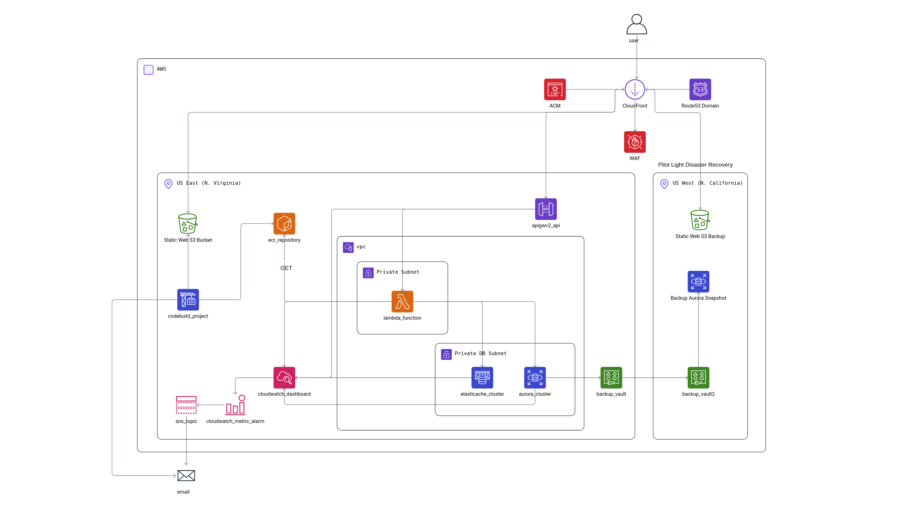

# Architecture Documentation

## Table of Contents

- [Architecture Overview](#architecture-overview)
- [Architecture Choice](#architecture-choice)
- [Logical Architecture](#logical-architecture)
- [Physical Architecture](#physical-architecture)
- [Component Details](#component-details)
- [Data Flow](#data-flow)
- [Network Architecture](#network-architecture)
- [Security Architecture](#security-architecture)
- [High Availability](#high-availability)
- [Disaster Recovery](#disaster-recovery)

---

## Architecture Overview

This project implements **Option B: Serverless Architecture** for the Habit Tracker application. The architecture leverages AWS serverless services to provide a scalable, cost-effective, and maintainable solution.

### Key Architectural Decisions

1. **Serverless Compute**: AWS Lambda with container images for the Django API
2. **Serverless Database**: Aurora Serverless v2 (PostgreSQL) for automatic scaling
3. **Serverless Cache**: ElastiCache Serverless (Redis) for session and cache storage
4. **Static Frontend**: React SPA hosted on S3 with CloudFront CDN
5. **API Gateway**: HTTP API for Lambda integration and request routing
6. **Infrastructure as Code**: Terraform with modular design

---

## Architecture Choice

### Why Serverless (Option B)?

**Selected**: Option B - Serverless Architecture

**Rationale**:
- **Cost Efficiency**: Pay only for actual usage (no idle costs)
- **Automatic Scaling**: Handles traffic spikes without manual intervention
- **Reduced Operational Overhead**: No server management, patching, or capacity planning
- **Fast Deployment**: Lambda container images enable rapid updates
- **Built-in High Availability**: AWS manages redundancy and failover

### Trade-off Analysis

| Aspect | Serverless (Option B) | ECS Fargate (Option A) |
|--------|----------------------|------------------------|
| **Scalability** | Automatic, instant | Requires service configuration |
| **Cost** | Pay per request (no idle) | Pay for running containers |
| **Cold Starts** | Possible (mitigated with provisioned concurrency) | No cold starts |
| **Complexity** | Lower (managed services) | Higher (container orchestration) |
| **Control** | Less control over runtime | More control |
| **Best For** | Variable traffic, cost-sensitive | Predictable traffic, need for control |

**Decision**: Serverless chosen for cost efficiency, automatic scaling, and reduced operational complexity, which aligns with the project's requirements, as this is a simple habit tracking app, which is projected to have spaced out requests.

---

## Logical Architecture

### High-Level Architecture Diagram

The
### Component Interaction Flow

1. **User Request** → Route53 DNS → CloudFront CDN
2. **CloudFront** → Routes to S3 (frontend) or API Gateway (API)
3. **API Gateway** → Invokes Lambda function
4. **Lambda** → Connects to Aurora (database) and ElastiCache (cache)
5. **Response** → Returns through API Gateway → CloudFront → User

---

## Physical Architecture

### AWS Region: us-east-1 (Primary)

#### Edge Layer (Global)

- **Route53**: DNS service for custom domain (`bardhi.devops.konitron.com`)
- **CloudFront**: Global CDN with edge locations worldwide
- **WAF**: Web Application Firewall protecting CloudFront
- **ACM**: SSL/TLS certificates for HTTPS

#### Compute Layer

- **API Gateway (HTTP API)**: 
  - Stage: `staging`
  - Integration: Lambda function
  - Routes: `/api/*`, `/health/`, `/Login/`, etc.
  
- **Lambda Function**:
  - Runtime: Container image (Django)
  - Image: Stored in ECR
  - VPC: Attached to private subnets
  - Memory: Auto-configured
  - Timeout: 30 seconds (default)

#### Data Layer

- **Aurora Serverless v2 (PostgreSQL)**:
  - Engine: PostgreSQL 16.1
  - Scaling: 0.5 ACU (min) to 4 ACU (max)
  - Multi-AZ: Yes (automatic)
  - Backup: 7-day retention, automated
  - Encryption: Enabled at rest

- **ElastiCache Serverless (Redis)**:
  - Engine: Redis 7
  - Storage: 1-10 GB
  - Multi-AZ: Yes (automatic)
  - TLS: Required

- **S3 Bucket**:
  - Purpose: Static frontend hosting
  - Versioning: Enabled
  - Public Access: Blocked (accessed via CloudFront OAC)

#### Network Layer

- **VPC**: `10.20.0.0/16`
  - **Public Subnets**: `10.20.0.0/24`, `10.20.1.0/24` (2 AZs)
  - **Private Subnets**: `10.20.16.0/24`, `10.20.17.0/24` (2 AZs)
  - **Internet Gateway**: For public subnet internet access
  - **NAT Gateway**: For private subnet outbound internet access
  - **Route Tables**: Separate for public and private subnets

#### Observability Layer

- **CloudWatch Logs**:
  - Lambda: `/aws/lambda/apprentice-final-staging-api`
  - API Gateway: `/aws/apigateway/apprentice-final-staging-http-api`
  - Aurora: PostgreSQL engine logs

- **CloudWatch Metrics**:
  - API Gateway: Request counts, latency, errors
  - Lambda: Invocations, duration, errors, throttles
  - Aurora: Connections, CPU, storage
  - ElastiCache: Connections, memory, CPU

- **CloudWatch Dashboard**: `apprentice-final-staging-overview`

- **CloudWatch Alarms**: 
  - API Gateway 5xx errors
  - API Gateway high latency
  - Lambda errors
  - Lambda throttles
  - Aurora high connections
  - Aurora high CPU
  - Redis high CPU
  - Redis high memory

- **SNS Topic**: Email notifications for alarms

#### Security Layer

- **IAM Roles**:
  - Lambda execution role (VPC, Secrets Manager, SSM access)
  - API Gateway CloudWatch role
  - Operator role (for Apprentice-Finale user)
  
- **Security Groups**:
  - Lambda: Egress only (all outbound)
  - Aurora: Ingress from Lambda (port 5432)
  - ElastiCache: Ingress from Lambda (port 6379)

- **Secrets Manager**: Database credentials
- **SSM Parameter Store**: Configuration parameters

#### CI/CD Layer

- **CodePipeline**: 3 pipelines (Terraform, Backend, Frontend)
- **CodeBuild**: Build projects for Terraform, Backend, Frontend
- **ECR**: Container image repository
- **S3**: Pipeline artifacts bucket

### Disaster Recovery Region: us-west-2

- **Backup Vault**: Cross-region backup replication
- **Backup Plans**: Hourly and daily backups with cross-region copy

---

## Component Details

### Frontend (React SPA)

**Technology**: React with Vite

**Deployment**:
- Built: `npm run build` → `dist/` directory
- Hosted: S3 bucket (static website hosting)
- CDN: CloudFront distribution
- Routing: CloudFront Function rewrites SPA routes to `index.html`

**Features**:
- Single Page Application (SPA)
- Client-side routing
- API integration via fetch/axios
- Session management via cookies

### Backend (Django API)

**Technology**: Django 4.1+ with Mangum (ASGI adapter)

**Deployment**:
- Container: Docker image stored in ECR
- Runtime: AWS Lambda (container image)
- Entry Point: `lambda_handler.py`

**Key Components**:
- **Django Apps**:
  - `habit` - Habit tracking functionality
  - `Users` - User management and authentication
- **Middleware**:
  - `AllowAllHostsMiddleware` - Bypass ALLOWED_HOSTS for Lambda
  - `CorsMiddleware` - CORS headers
  - `StripStagePrefixMiddleware` - Remove API Gateway stage prefix
- **Health Check**: `/health/` endpoint
- **API Endpoints**: `/api/*` routes

**Configuration**:
- Database: Aurora PostgreSQL (via Secrets Manager)
- Cache: ElastiCache Redis (via SSM)
- Sessions: Stored in Redis
- CSRF: Cookie-based with trusted origins

### Database (Aurora Serverless v2)

**Technology**: PostgreSQL 16.1

**Configuration**:
- **Scaling**: Auto-scales between 0.5 and 4 ACU
- **Multi-AZ**: Automatic (spans 2+ availability zones)
- **Backup**: 7-day retention, automated hourly and daily
- **Encryption**: Enabled at rest (KMS)
- **Network**: Private subnets only
- **Access**: Lambda via security group rules

**Endpoints**:
- Writer: Primary endpoint for writes
- Reader: Read replica endpoint (optional)

### Cache (ElastiCache Serverless)

**Technology**: Redis 7

**Configuration**:
- **Storage**: 1-10 GB (auto-scales)
- **Multi-AZ**: Automatic
- **TLS**: Required (rediss://)
- **Network**: Private subnets only
- **Access**: Lambda via security group rules

**Usage**:
- Session storage (Django sessions)
- General caching (Django cache framework)

### API Gateway

**Type**: HTTP API (v2)

**Configuration**:
- **Stage**: `staging`
- **Integration**: Lambda function (proxy integration)
- **Routes**: 
  - `/api/*` → Lambda
  - `/health/` → Lambda
  - `/Login/`, `/Register/`, etc. → Lambda
- **CORS**: Handled by Django middleware
- **Logging**: CloudWatch Logs enabled

### CloudFront

**Configuration**:
- **Origins**:
  - S3 bucket (frontend) - OAC authentication
  - API Gateway (backend) - Direct integration
- **Behaviors**:
  - Default: S3 (frontend)
  - `/api/*`: API Gateway
  - Specific routes: API Gateway
- **Functions**: SPA routing rewrite
- **WAF**: Associated web ACL
- **HTTPS**: ACM certificate

### WAF

**Configuration**:
- **Scope**: CloudFront
- **Rules**: Custom rules for application-specific protection
- **Managed Rules**: AWS Managed Rules (optional, currently disabled)

---

## Data Flow

### User Request Flow

1. **User** → Types URL in browser
2. **DNS Resolution** → Route53 resolves to CloudFront distribution
3. **CloudFront** → Checks cache, routes based on path:
   - Static assets (`/static/*`, `/*.js`, `/*.css`) → S3
   - API calls (`/api/*`) → API Gateway
   - SPA routes (`/`, `/habits`, etc.) → S3 (rewritten to `index.html`)
4. **API Gateway** → Invokes Lambda function
5. **Lambda** → Processes request:
   - Checks Redis for session/cache
   - Queries Aurora if needed
   - Returns JSON response
6. **Response** → Returns through API Gateway → CloudFront → User

### Authentication Flow

1. **User** → Submits login form
2. **Frontend** → POST to `/Login/`
3. **API Gateway** → Routes to Lambda
4. **Lambda** → Django authenticates user
5. **Django** → Creates session in Redis
6. **Response** → Sets session cookie (HttpOnly, Secure, SameSite=None)
7. **Subsequent Requests** → Cookie sent automatically, session validated

### Database Query Flow

1. **Lambda** → Needs database data
2. **Django ORM** → Generates SQL query
3. **Connection** → Connects to Aurora writer endpoint
4. **Aurora** → Executes query, returns results
5. **Lambda** → Processes results, returns JSON

---

## Network Architecture

### VPC Design

**CIDR**: `10.20.0.0/16`

**Subnets**:
- **Public Subnets** (2 AZs):
  - `10.20.0.0/24` (us-east-1a)
  - `10.20.1.0/24` (us-east-1b)
  - Purpose: NAT Gateway, Internet Gateway attachment
  
- **Private Subnets** (2 AZs):
  - `10.20.16.0/24` (us-east-1a)
  - `10.20.17.0/24` (us-east-1b)
  - Purpose: Lambda ENIs, Aurora, ElastiCache

**Routing**:
- **Public Route Table**: Routes `0.0.0.0/0` → Internet Gateway
- **Private Route Table**: Routes `0.0.0.0/0` → NAT Gateway

**Internet Access**:
- **Outbound**: Lambda → NAT Gateway → Internet Gateway → Internet
- **Inbound**: Internet → CloudFront/API Gateway (no VPC ingress needed)

### Security Groups

**Lambda Security Group**:
- **Egress**: All traffic (`0.0.0.0/0`)
- **Purpose**: Allow Lambda to connect to Aurora, Redis, AWS APIs

**Aurora Security Group**:
- **Ingress**: Port 5432 from Lambda security group
- **Egress**: None (not needed)

**ElastiCache Security Group**:
- **Ingress**: Port 6379 from Lambda security group
- **Egress**: None (not needed)

---

## Security Architecture

### Network Security

- **VPC Isolation**: All resources in private subnets
- **Security Groups**: Least-privilege rules
- **No Public IPs**: Lambda, Aurora, Redis have no public IPs
- **NAT Gateway**: Controlled outbound internet access

### Application Security

- **WAF**: Protects against common web exploits
- **HTTPS Only**: All traffic encrypted in transit
- **Secrets Management**: Database credentials in Secrets Manager
- **IAM**: Least-privilege roles for all services
- **CORS**: Configured for specific origins
- **CSRF Protection**: Django CSRF tokens with trusted origins

### Data Security

- **Encryption at Rest**: 
  - Aurora: KMS encryption
  - S3: Server-side encryption
  - Secrets Manager: KMS encryption
- **Encryption in Transit**:
  - HTTPS (TLS 1.2+)
  - Redis: TLS required
  - Database: TLS connections

---

## High Availability

### Multi-AZ Deployment

- **Aurora**: Automatically spans multiple AZs
- **ElastiCache Serverless**: Automatically spans multiple AZs
- **Lambda**: Can run in any AZ (managed by AWS)
- **NAT Gateway**: One per AZ (optional, currently single NAT)

### Automatic Failover

- **Aurora**: Automatic failover to read replica (< 1 minute RTO)
- **ElastiCache**: Automatic failover (managed by AWS)
- **CloudFront**: Global edge locations (automatic failover)

### Redundancy

- **S3**: 99.999999999% (11 9's) durability
- **Aurora**: 6 copies across 3 AZs
- **ElastiCache**: Multi-AZ replication

---

## Disaster Recovery

### Strategy: Pilot Light

**RTO**: 4 hours  
**RPO**: 1 hour

### Backup Configuration

- **Aurora Backups**:
  - Hourly backups (7-day retention)
  - Daily backups (90-day retention)
  - Cross-region copy to us-west-2
  
- **ElastiCache**: Ephemeral (can be rebuilt from application)

### DR Region

- **Region**: us-west-2
- **Resources**: Backup vault for cross-region replication
- **Failover**: Manual process (see `docs/RUNBOOK_DR.md`)

---

## Scalability

### Automatic Scaling

- **Lambda**: Scales automatically based on requests
- **Aurora Serverless v2**: Auto-scales ACU based on load
- **ElastiCache Serverless**: Auto-scales storage based on data
- **CloudFront**: Global edge network handles traffic spikes

### Performance Optimization

- **CloudFront Caching**: Static assets cached at edge
- **Redis Caching**: Reduces database load
- **Connection Pooling**: Django database connection pooling
- **CDN**: Reduces latency for global users

---

## Cost Optimization

- **Serverless Services**: Pay only for usage
- **Aurora Serverless**: Scales down to 0.5 ACU when idle
- **ElastiCache Serverless**: Pay only for data stored
- **S3 Static Hosting**: Cost-effective for static content
- **CloudFront**: Free tier includes 1TB transfer

See [COST.md](COST.md) for detailed cost analysis.
