# Option B: Serverless Architecture Diagram

This document contains the Mermaid diagram for the Serverless Architecture (Option B) for the **Django Habit Tracker** application, aligned with the Apprentice Final Project requirements.

## Architecture Overview

```mermaid
graph TB
    subgraph "Internet"
        Users[Users<br/>Habit Tracker App]
    end

    subgraph "AWS Global Services"
        Route53[Route53<br/>DNS<br/>project.yourname.com]
        CloudFront[CloudFront<br/>CDN Distribution<br/>Global Edge Locations]
        WAF[AWS WAF<br/>Web Application Firewall<br/>Rate Limiting & Security]
        ACM[ACM<br/>SSL/TLS Certificate]
        IAM[IAM<br/>Roles & Policies<br/>Global Identity Service]
    end

    subgraph "AWS Region (us-east-1)"
        subgraph "Edge Services"
            CloudFrontOrigin[CloudFront Origin<br/>Regional Distribution]
        end

        subgraph "Frontend Layer"
            S3Frontend[S3 Bucket<br/>Static Web Hosting<br/>React SPA Build<br/>Nginx Configuration]
        end

        subgraph "API Layer"
            APIGateway[API Gateway<br/>REST API<br/>/api/* Endpoints<br/>Request Validation]
            Lambda[Lambda Function<br/>Django API<br/>Container Image<br/>VPC Enabled<br/>/aws/app/env Log Group]
        end

            subgraph "VPC - Network Layer"
            subgraph "Public Subnets"
                NATGateway[NAT Gateway<br/>Internet Access<br/>for Lambda]
                InternetGW[Internet Gateway]
            end
            
            subgraph "Private Subnets"
                LambdaVPC[Lambda VPC<br/>ENI in Private Subnet]

        subgraph "Data Layer"
                    Database[(Aurora Serverless v2<br/>PostgreSQL<br/>OR<br/>DynamoDB)]
                    RDSProxy[RDS Proxy<br/>Connection Pooling<br/>Optional]
            Cache[(ElastiCache<br/>Serverless<br/>Redis)]
                end
                
                subgraph "VPC Endpoints"
                    S3Endpoint[S3 Gateway Endpoint<br/>FREE]
                    CloudWatchEndpoint[CloudWatch Logs<br/>Interface Endpoint]
                end
            end
        end

        subgraph "Storage"
            S3Media[S3 Bucket<br/>Media Files<br/>User Uploads<br/>Static Assets]
            ECR[ECR<br/>Container Registry<br/>Django API Image]
            TerraformState[S3 Bucket<br/>Terraform State]
        end

        subgraph "Infrastructure as Code"
            TerraformLock[DynamoDB Table<br/>State Locking]
        end

        subgraph "CI/CD Pipeline"
            CodePipeline[CodePipeline<br/>or<br/>GitHub Actions]
            BuildStage[Build Stage<br/>Build Container Image]
            DeployStage[Deploy Stage<br/>Terraform Apply]
            TestStage[Test Stage<br/>/health Endpoint]
            Approval[Manual Approval]
            NotifyStage[Notify Stage<br/>SNS Notification]
        end

        subgraph "Monitoring & Alerting"
            CloudWatch[CloudWatch<br/>Logs Groups<br/>Metrics<br/>Dashboards]
            CloudWatchAlarms[CloudWatch Alarms<br/>5xx Error Rate >5%<br/>High Latency/CPU]
            SNS[SNS Topic<br/>Email Alerts]
            CloudWatchDashboard[CloudWatch Dashboard<br/>Request Counts 2xx/4xx/5xx<br/>Latency<br/>DB Connections<br/>Cache Hit Ratio]
        end

        subgraph "Security"
            SecretsManager[Secrets Manager<br/>or<br/>SSM Parameter Store<br/>DB Credentials<br/>API Keys]
        end
    end

    %% User Request Flow (Global to Regional)
    Users -->|HTTPS Request| Route53
    Route53 -->|DNS Resolution| CloudFront
    CloudFront -->|HTTPS with ACM| ACM
    CloudFront -->|Traffic| WAF
    CloudFront -->|Regional Origin| CloudFrontOrigin
    WAF -->|Static Assets| S3Frontend
    WAF -->|API Requests /api/*| APIGateway

    %% Frontend Flow
    S3Frontend -.->|Serves| Users

    %% API Flow (Regional)
    APIGateway -->|Invoke| Lambda
    Lambda -->|VPC Connection| LambdaVPC
    LambdaVPC -->|Read/Write| Database
    LambdaVPC -.->|Via Proxy| RDSProxy
    RDSProxy -->|Connection Pool| Database
    LambdaVPC -->|Cache Operations| Cache
    Lambda -->|Upload Files| S3Media
    Lambda -->|Via Endpoint| S3Endpoint
    S3Endpoint -->|Access| S3Media

    %% CI/CD Flow (Regional)
    CodePipeline --> BuildStage
    BuildStage -->|Push Image| ECR
    BuildStage --> DeployStage
    DeployStage -->|Terraform Apply| TerraformState
    DeployStage -->|State Lock| TerraformLock
    DeployStage -->|Configure Lambda| Lambda
    Lambda -->|Pull Container Image| ECR
    DeployStage --> TestStage
    TestStage -->|Health Check| Lambda
    TestStage --> Approval
    Approval -->|Deploy to Prod| DeployStage
    DeployStage --> NotifyStage
    NotifyStage -->|Send Notification| SNS

    %% Monitoring Flow (Regional)
    Lambda -.->|Logs via Endpoint| CloudWatchEndpoint
    Lambda -.->|Logs| CloudWatch
    APIGateway -.->|Metrics| CloudWatch
    Database -.->|Metrics| CloudWatch
    Cache -.->|Metrics| CloudWatch
    CloudWatchEndpoint -->|Route to| CloudWatch
    CloudWatch --> CloudWatchDashboard
    CloudWatch --> CloudWatchAlarms
    CloudWatchAlarms -->|Trigger| SNS
    SNS -->|Email| Users

    %% Security Flow (Global IAM to Regional Resources)
    IAM -->|Assume Role| Lambda
    IAM -->|Assume Role| APIGateway
    Lambda -->|Retrieve Secrets| SecretsManager
    
    %% VPC Internet Access Flow
    LambdaVPC -->|Internet via| NATGateway
    NATGateway -->|Route to| InternetGW
    InternetGW -->|Internet Access| ECR
    LambdaVPC -->|ECR Image Pull| ECR

    %% Styling
    classDef frontend fill:#fff3cd,stroke:#856404,stroke-width:2px
    classDef api fill:#ffeaa7,stroke:#856404,stroke-width:2px
    classDef compute fill:#e1bee7,stroke:#6a1b9a,stroke-width:2px
    classDef storage fill:#c8e6c9,stroke:#2e7d32,stroke-width:2px
    classDef network fill:#d4edda,stroke:#155724,stroke-width:2px
    classDef monitoring fill:#e0e0e0,stroke:#424242,stroke-width:2px,stroke-dasharray: 5 5
    classDef cicd fill:#bbdefb,stroke:#1976d2,stroke-width:2px
    classDef security fill:#f8bbd0,stroke:#c2185b,stroke-width:2px
    classDef iac fill:#d1c4e9,stroke:#7b1fa2,stroke-width:2px

    class S3Frontend frontend
    class APIGateway api
    class Lambda,LambdaVPC compute
    class Database,Cache,S3Media,ECR,TerraformState,RDSProxy storage
    class Route53,CloudFront,WAF,ACM,CloudFrontOrigin,NATGateway,InternetGW network
    class CloudWatch,CloudWatchAlarms,CloudWatchDashboard,SNS,CloudWatchEndpoint monitoring
    class CodePipeline,BuildStage,DeployStage,TestStage,Approval,NotifyStage cicd
    class IAM,SecretsManager security
    class TerraformLock,S3Endpoint iac
```

## Component Descriptions

### AWS Global Services (Outside Region)

These services operate globally and are not tied to a specific AWS region:

- **Route53**: Global DNS service that routes user requests to CloudFront using custom domain (e.g., `project.yourname.com`)
  - Operates from edge locations worldwide
  - Provides DNS resolution globally

- **CloudFront**: Global CDN with edge locations worldwide
  - Caches and delivers content from nearest edge location
  - Improves latency and reduces origin load
  - Routes to regional origins (S3, API Gateway)

- **AWS WAF**: Global Web Application Firewall
  - Filters malicious traffic globally
  - Implements rate limiting and security rules
  - Protects against common attacks (OWASP Top 10)

- **ACM (AWS Certificate Manager)**: Global certificate management
  - Manages SSL/TLS certificates for HTTPS on CloudFront (bonus requirement)
  - Certificates are regional but managed globally

- **IAM**: Global identity and access management service
  - Roles and policies are global
  - Used by all regional services for authentication and authorization

### AWS Regional Services (Inside Region)

These services are deployed within a specific AWS region (e.g., `us-east-1`):

#### Frontend Layer
- **S3 Frontend**: Regional S3 bucket for static web hosting
  - Contains built React app (from `npm run build`)
  - Serves static assets (HTML, CSS, JS)
  - Configured for SPA routing
  - Served via CloudFront (global) but stored in region

#### API Layer
- **API Gateway**: Regional REST API endpoint that handles `/api/*` routes
  - Request validation and transformation
  - Rate limiting and throttling
  - Integration with Lambda function
  - Deployed in specific region

- **Lambda Function**: Regional serverless compute running Django API
  - Uses container image from ECR (regional)
  - VPC-enabled for secure database access
  - Logs to CloudWatch Logs group: `/aws/app/<env>` (regional)
  - Handles all Django API endpoints (habits, tasks, streaks, achievements, analytics)

#### VPC Network Layer
- **Public Subnets**: Contain internet-facing resources
  - **NAT Gateway**: Provides internet access for Lambda in private subnets
    - Routes outbound traffic from private subnets to internet
    - Required for Lambda to pull container images from ECR
    - Can use single NAT Gateway (cost optimization) or multi-AZ (HA)
  - **Internet Gateway**: Provides internet connectivity to VPC

- **Private Subnets**: Contain internal resources
  - **Lambda VPC ENI**: Elastic Network Interface for Lambda function
    - Allows Lambda to access resources in VPC
    - Attached to private subnets for security
    - Adds 2-10 second cold start penalty

#### Data Layer (VPC - Private Subnets)
- **Aurora Serverless v2** (Recommended) or **DynamoDB**: Regional serverless database
  - Aurora Serverless v2: PostgreSQL-compatible, auto-scaling, better fit for Django ORM
  - DynamoDB: NoSQL alternative if migrating to serverless data model
  - Deployed in VPC private subnets within region
  - Accessible only from Lambda via VPC

- **RDS Proxy** (Optional but Recommended): Connection pooling service
  - Reduces connection overhead for Lambda
  - Helps mitigate cold start impact
  - Provides connection pooling to Aurora Serverless v2
  - Improves performance and reduces database load

- **ElastiCache Serverless**: Regional serverless Redis for caching
  - Session storage
  - Frequently accessed data caching
  - Improves API response times
  - Deployed in VPC private subnets
  - Accessible only from Lambda via VPC

#### VPC Endpoints
- **S3 Gateway Endpoint**: FREE VPC endpoint for S3 access
  - Allows Lambda to access S3 without NAT Gateway
  - Reduces data transfer costs
  - No additional charges

- **CloudWatch Logs Interface Endpoint**: Private connectivity to CloudWatch
  - Allows Lambda to send logs without internet access
  - Reduces NAT Gateway data transfer costs
  - Improves security (logs stay within AWS network)

#### Storage
- **S3 Media Bucket**: Regional object storage for user-uploaded files
  - Habit-related media files
  - Static assets served by Django
  - Configured with appropriate IAM policies
  - Stored in specific region

- **ECR (Elastic Container Registry)**: Regional container registry
  - Stores Lambda container image
  - Used by CI/CD pipeline
  - Images are region-specific

#### Infrastructure as Code
- **S3 Bucket**: Regional Terraform remote state backend
  - Stores Terraform state files
  - Versioned and encrypted
  - Region-specific storage

- **DynamoDB Table**: Regional state locking for Terraform
  - Prevents concurrent modifications
  - Ensures state consistency
  - Region-specific table

#### CI/CD Pipeline
- **CodePipeline or GitHub Actions**: Regional automated deployment pipeline
  - **Build Stage**: Builds Docker container image for Django API
  - **Deploy to Staging**: Terraform plan & apply for staging environment
  - **Test Stage**: Invokes `/health` endpoint to validate deployment
  - **Approval Step**: Manual approval before production deployment
  - **Deploy to Production**: Terraform apply for production environment
  - **Notify Stage**: Sends notification via SNS (email or Slack)
  - Pipeline runs in specific region

#### Monitoring & Alerting
- **CloudWatch Logs**: Regional centralized logging
  - Lambda function logs: `/aws/app/<env>`
  - API Gateway access logs
  - Application logs from Django
  - Logs stored in region

- **CloudWatch Metrics**: Regional performance and health metrics
  - API Gateway: Request counts (2xx, 4xx, 5xx), latency
  - Lambda: Invocations, errors, duration, throttles
  - Database: Connections, throttles, read/write operations
  - ElastiCache: Cache hit ratio, memory usage

- **CloudWatch Dashboard**: Regional visual monitoring dashboard
  - Request counts (2xx / 4xx / 5xx)
  - Latency metrics
  - DB connections and throttles
  - Cache hit ratio

- **CloudWatch Alarms**: Regional automated alerting
  - High 5xx error rate (>5% for 5 minutes)
  - High latency or CPU usage
  - Alarms evaluated in region

- **SNS Topic**: Regional notification service
  - Receives alarm triggers
  - Sends email alerts to subscribed users
  - Topic created in specific region

#### Security
- **Secrets Manager or SSM Parameter Store**: Regional secure credential storage
  - Database credentials
  - API keys
  - Django SECRET_KEY
  - Redis connection strings
  - Secrets stored in region

## Data Flow

### 1. User Request Flow (Global → Regional)
1. User accesses `project.yourname.com` (Route53 DNS - **Global**)
2. Route53 resolves to CloudFront distribution (**Global**)
3. CloudFront uses ACM certificate for HTTPS (**Global**)
4. Traffic passes through WAF for security filtering (**Global**)
5. CloudFront routes to regional origin (**Regional**)
6. Static assets (React app) served from S3 Frontend (**Regional**)
7. API requests (`/api/*`) routed to API Gateway (**Regional**)

### 2. API Processing Flow (All Regional)
1. API Gateway (**Regional**) receives request, validates and transforms
2. API Gateway invokes Lambda function (Django API) (**Regional**)
3. Lambda (VPC-enabled) connects to private subnets via ENI (**Regional VPC**)
4. Lambda reads/writes to Aurora Serverless v2 (PostgreSQL) via RDS Proxy (**Regional**)
   - RDS Proxy provides connection pooling (optional but recommended)
5. Lambda uses ElastiCache Serverless (Redis) for caching (**Regional**)
6. Lambda uploads media files to S3 Media bucket via S3 Gateway Endpoint (**Regional**)
   - Uses VPC endpoint (no NAT Gateway required for S3)
7. Response returned through API Gateway to user (**Regional → Global → User**)

### 3. CI/CD Deployment Flow (Regional)
1. Code pushed to repository triggers pipeline (**Regional**)
2. Build stage creates Docker image and pushes to ECR (**Regional**)
3. Deploy stage runs Terraform plan & apply (**Regional**)
4. Terraform configures Lambda function with ECR image URI (**Regional**)
5. Lambda service pulls container image from ECR (**Regional**)
   - Lambda authenticates to ECR using IAM role
   - Image pulled via NAT Gateway (if not using VPC endpoint for ECR)
   - Image cached by Lambda for faster subsequent invocations
6. Test stage validates deployment via `/health` endpoint (**Regional**)
7. Manual approval required for production
8. Production deployment via Terraform (**Regional**)
9. Notification sent via SNS (**Regional**)

### 4. Monitoring Flow (Regional)
- Lambda sends logs via CloudWatch Logs Interface Endpoint (**Regional VPC**)
  - Logs route through VPC endpoint (no internet/NAT required)
  - Reduces data transfer costs
- Lambda also sends logs directly to CloudWatch (**Regional**)
- API Gateway, Database, and Cache send metrics to CloudWatch (**Regional**)
- CloudWatch Dashboard aggregates metrics for visualization (**Regional**)
- CloudWatch Alarms monitor thresholds (**Regional**)
- When alarms trigger, SNS sends email notifications (**Regional → Internet**)
- IAM roles (Global) authorize access to regional resources

### 5. VPC Internet Access Flow (Regional)
- Lambda in private subnet needs internet access for:
  - Pulling container images from ECR (during deployment/cold start)
  - Accessing AWS services not covered by VPC endpoints
- Traffic flow: Lambda → NAT Gateway → Internet Gateway → Internet
- S3 access uses Gateway Endpoint (no NAT Gateway required)
- CloudWatch Logs uses Interface Endpoint (no NAT Gateway required)
- ECR access typically uses NAT Gateway (or can use VPC endpoint for cost optimization)

## Architecture Organization

### Global vs Regional Services

**Global Services** (Outside Region):
- Route53, CloudFront, WAF, ACM, IAM
- These services operate globally and are not tied to a specific region
- Provide edge services and global identity management

**Regional Services** (Inside Region):
- All compute, storage, database, monitoring, and CI/CD services
- Deployed within a specific AWS region (e.g., `us-east-1`)
- Regional services can be replicated across multiple regions for multi-region support (bonus requirement)

### Color Coding

- **Yellow**: Frontend and API Gateway components
- **Purple**: Compute (Lambda, VPC)
- **Green**: Storage services (Database, Cache, S3, ECR)
- **Light Green**: Network services (DNS, CDN, WAF, ACM)
- **Gray (dashed)**: Monitoring services (CloudWatch, Alarms, SNS)
- **Blue**: CI/CD Pipeline components
- **Pink**: Security and IAM components
- **Purple (light)**: Infrastructure as Code components

## VPC Configuration Details

### Network Architecture
- **VPC CIDR**: 10.0.0.0/16 (recommended)
- **Public Subnets**: 10.0.1.0/24, 10.0.2.0/24 (multi-AZ for HA)
- **Private Subnets**: 10.0.10.0/24, 10.0.11.0/24 (multi-AZ for HA)
- **Availability Zones**: Minimum 2 AZs for high availability

### Security Groups
- **Lambda Security Group**:
  - Outbound: All traffic (0.0.0.0/0) for NAT Gateway access
  - Outbound: Aurora (5432) and ElastiCache (6379) for database/cache access
- **Aurora Security Group**:
  - Inbound: Lambda Security Group on port 5432
- **ElastiCache Security Group**:
  - Inbound: Lambda Security Group on port 6379

### Cost Optimization
- **Single NAT Gateway**: ~$32/month (staging/dev)
- **Multi-AZ NAT Gateway**: ~$64/month (production)
- **S3 Gateway Endpoint**: FREE
- **CloudWatch Logs Interface Endpoint**: ~$7/month
- **Total VPC Costs**: ~$39-44/month (hybrid approach)

### Performance Considerations
- **Cold Start Penalty**: 2-10 seconds when Lambda ENI attaches to VPC
- **Mitigation**: Use RDS Proxy for connection pooling, provisioned concurrency (optional)
- **Warm Starts**: Subsequent invocations use cached ENI (faster)

## Application-Specific Details

### Django Habit Tracker Features Supported
- **User Authentication**: Session-based auth with Redis caching
- **Habit Management**: CRUD operations via Django REST API
- **Task Generation**: Automatic task creation based on habits
- **Streak Tracking**: Real-time streak calculations
- **Achievements**: Milestone tracking and rewards
- **Analytics**: Data visualization and progress tracking
- **Media Uploads**: User file uploads stored in S3 via VPC endpoint

### Environment Variables (from .env)
All configuration externalized via environment variables:
- Database connection strings
- Redis connection details
- Django SECRET_KEY
- AWS credentials (via IAM roles, not hard-coded)
- API endpoints
- Log levels

### Health Checks
- API Gateway: `/health` endpoint
- Lambda: Django health check endpoint
- Used by CI/CD pipeline for deployment validation
